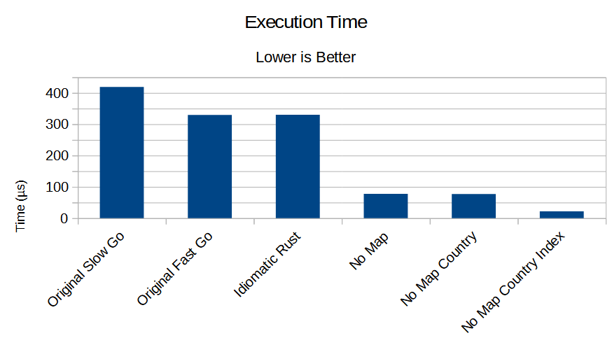

# Getting Friendly With CPU Caches

Reading [Getting Friendly With CPU Caches](https://www.ardanlabs.com/blog/2023/07/getting-friendly-with-cpu-caches.html), by Miki Tebeka and William Kennedy, inspired me to look at some Rust equivalents.

I've used Criterion for benchmarks, and the final version users the `itertools` crate.

## Techniques

1. [original_slow_go.rs](./src/original_slow_go.rs) - a line-by-line port of the original---sluggish---Go code.
2. [original_fast_go.rs](./src/original_fast_go.rs) - a line-by-line port of the improved---fast---Go code. `Image` has been turned into a `Box`, a safe (no null pointer issues here) pointer to a heap-allocated `Image` struct.
3. [idiomatic_rust](./src/idiomatic_rust.rs) takes the code from (2), and replaces the `for` loops with an iterator-based approach. This retains the `HashMap`, countries are still strings---but using an iterator allows the compiler to elide some bounds checks.
4. [no_map](./src/no_map.rs) removes the `HashMap` completely---because hashing is slow. Instead, it returns a vector of tuples (count, country string).
5. [no_map_country](./src/no_map_country.rs) is the same as (4), but replaces the country string with a pointer to the static countries list.
6. [no_map_country_idx](./src/no_map_country_idx.rs) replaces country altogether with an index into the countries list. This could easily be stored separately and re-attached as needed (when returning the user via the API). It'll make your API faster if your client obtains and keeps a country list, too!

All benchmarks were performed under Windows 11, on a 12th generation Intel Core i7 with 32 gb of RAM.

## Results

Test | Mean Performance
--- | ---
original_slow_go | 419.24 µs
original_fast_go | 329.51 µs
idiomatic_rust | 330.13 µs
no_map | 77.627 µs
no_map_country | 77.256 µs
no_map_country_idx | 21.911 µs

## Explanation

The original article explains the difference between the "slow" and "fast" Go---the `User` structure shrinks massively by storing a pointer to the image data, allowing for much better cache utilization. Translating the `for` loop into a Rust iterator makes a negligible difference---they compile into very similar code.

`no_map` reasoned that the `HashMap`---in particular hashing values---was taking up a lot of time. Sorting is *very* fast, and `itertools` provides a great `dedup_with_counts` function. Combining the two gives you a `HashMap`-free solution. The speed increase is huge.

I then reasoned that chasing pointers for strings was problematic. The `no_map_country` example offered very little improvement: instead of discrete strings, it reduces memory usage by storing the countries once and pointing to that structure. The performance difference was negligible.

Using an *index* of the country table is massively faster. The `User` structure is still the same size---a `usize` and a pointer are the same size. But storing just the index removes an entire "pointer chase"---the program doesn't have to follow the pointer into the countries table to read the value. It just reads the index. This is a huge win.
